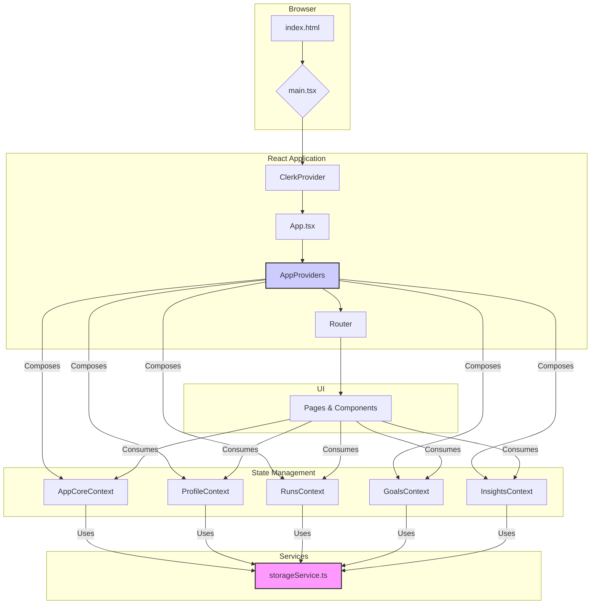

# Runa Application Architecture

This document outlines the software architecture of the Runa application, a modern web-based platform for tracking running activities.

## 1. Core Technology Stack

- **Frontend Framework**: React (v18.2.0)
- **Build Tool**: Vite
- **Language**: TypeScript
- **Styling**: Tailwind CSS with PostCSS
- **Routing**: React Router
- **Authentication**: Clerk

## 2. High-Level Architecture

Runa is a **Single Page Application (SPA)** built on a modular, component-based architecture. The core design philosophy centers around a **decoupled state management system** using React's Context API, ensuring a clear separation of concerns and maintainable code.

The application follows a standard client-side rendering model:
1.  The initial `index.html` loads the Vite-bundled JavaScript.
2.  `main.tsx` serves as the entry point, rendering the root `App` component.
3.  Authentication is handled at the highest level by wrapping the application in Clerk's `ClerkProvider`.
4.  The `App` component sets up routing and wraps the core application logic within a series of context providers.

## 3. Key Architectural Components

### 3.1. State Management: Context API

The application avoids external state management libraries like Redux or Zustand in favor of a pure React solution. State is divided into logical domains, with each domain managed by its own Context Provider.

-   **`AppProviders.tsx`**: This is the cornerstone of the state management system. It acts as a composition root, wrapping its children with all the necessary providers in the correct order. This ensures that any component in the tree can access any piece of state it needs.

-   **Context Domains**:
    -   **`AppCoreContext`**: Manages global concerns, such as the loading state and data refresh logic. It listens for authentication changes from Clerk and triggers a global data refresh event.
    -   **`ProfileContext`**: Manages user profile information (name, gender, etc.).
    -   **`RunsContext`**: Manages the list of all running activities.
    -   **`GoalsContext`**: Manages user-defined running goals.
    -   **`InsightsContext`**: Manages AI-generated insights based on running data.

### 3.2. Data Persistence: `storageService.ts`

**`storageService.ts` is a critical architectural component that centralizes all data persistence.** Instead of letting each context manage its own storage, this service provides a unified API for all `localStorage` interactions.

-   **Single Source of Truth**: All application data (profile, runs, goals) is stored in the browser's `localStorage`. This service is the *only* module that reads from or writes to `localStorage`.
-   **Decoupling**: The context providers are decoupled from the storage mechanism. They simply call functions from `storageService` (e.g., `saveRuns(runs)`, `getProfile()`), without needing to know the implementation details. This makes the architecture more modular and easier to refactor (e.g., to switch to a cloud-based backend).
-   **Initialization**: The service handles the initial setup for new users, ensuring that the `localStorage` has a default structure.

### 3.3. Data Synchronization: Custom Events

To prevent tight coupling between different state contexts, the application uses a custom browser event (`appDataRefresh`) for data synchronization.

1.  The `AppCoreContext` listens for changes in the authentication state via Clerk's `useUser` hook.
2.  When a user logs in or out, or when a manual refresh is triggered, `AppCoreContext` dispatches a `CustomEvent` named `appDataRefresh` on the `window` object.
3.  All other data contexts (`ProfileContext`, `RunsContext`, etc.) have event listeners that wait for this event.
4.  Upon receiving the event, each context re-reads its data from the `storageService`.

This event-driven approach ensures that all parts of the application have the most up-to-date data without needing direct references to each other.

### 3.4. Components and UI

-   **`pages/`**: Contains top-level components that correspond to application routes (e.g., `Dashboard.tsx`, `Analytics.tsx`). These are lazy-loaded in `App.tsx` to improve initial load times.
-   **`components/`**: Contains reusable UI elements, from atomic components (`InputField.tsx`, `Card.tsx`) to more complex, feature-specific ones (`RunForm.tsx`, `StreakHeatmap.tsx`).
-   **`hooks/`**: Contains custom hooks that encapsulate complex logic, such as data fetching (`useAnalyticsData.ts`) or UI animations (`useAudioVisualizer.ts`).

### 3.5. Services

-   **`aiService.ts`**: Responsible for interacting with an external AI service to generate insights about the user's runs.
-   **`storageService.ts`**: As described above, handles all data persistence.
-   **Notification Services (`emailService.ts`, `telegramService.ts`)**: Encapsulate logic for sending notifications through different channels.

## 4. Authentication and Routing

-   **`ProtectedRoute.tsx`**: This component wraps routes that require an authenticated user. It uses Clerk's hooks to check the user's session status and redirects to the login page if the user is not authenticated.
-   **`Login.tsx`**: The public-facing login page, which likely utilizes Clerk's pre-built UI components for the sign-in and sign-up process.
-   **`App.tsx`**: Defines the application's routes using `react-router-dom`, associating paths with their corresponding page components and applying lazy loading and protection logic.
