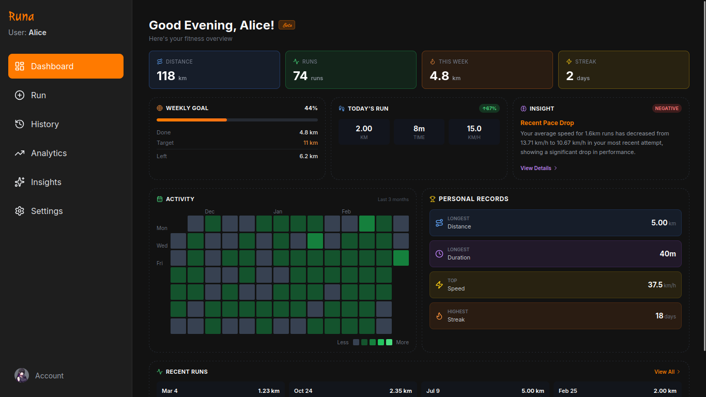

<div align="center">



</div>

> More screenshots available in public/images/ folder

# Runa - AI Fitness Tracker

A modern, AI-powered fitness tracking application designed to monitor your running progress, set personalized goals, and provide intelligent insights into your performance. Built with React, TypeScript, and powered by Google Gemini AI.

## Features

### Core Functionality
- Run Tracking: Log runs with distance, time, pace, and personal notes
- Goal Setting: Set weekly distance targets and running frequency goals
- Performance Analytics: View detailed charts and trends of your progress
- AI Insights: Get intelligent recommendations powered by Google Gemini
- Progress Dashboard: Overview of recent activities and achievements
- Audio Feedback: Success and error sounds for better user experience
- Voice Help: Male and female voice assistance for guidance

### Analytics & Visualization
- Pace Trends: Track your running pace over time in MM:SS format
- Speed Analysis: Monitor average and maximum speed improvements
- Distance Tracking: Weekly and monthly distance summaries
- Activity Heatmap: Visual representation of running frequency
- Performance Charts: Interactive graphs with detailed tooltips
- Statistics Overview: Total runs, distance, and time tracking

### Data Management
- Local Storage: All data stored securely in your browser
- Backup & Restore: Export and import data as JSON files
- Data Privacy: Complete privacy with no external data storage
- User Authentication: Secure access with Clerk authentication
- Profile Management: Customize your personal information and preferences

### User Experience
- Responsive Design: Optimized for desktop and mobile devices
- Modern Dark Theme: Easy on the eyes with sleek UI
- Toast Notifications: User-friendly feedback with audio cues
- Smooth Navigation: Intuitive routing with lazy loading
- FAQ Section: Built-in help with animated typing effects
- Image Carousel: Visual showcase on login page

## Technology Stack

- Frontend: React 19.2.0 with TypeScript
- Routing: React Router DOM 7.9.6
- Authentication: Clerk for secure user management
- Charts: Recharts 3.4.1 for data visualization
- Icons: Lucide React for modern iconography
- Styling: Tailwind CSS via CDN
- Build Tool: Vite 6.2.0
- AI Integration: Google Gemini API for intelligent insights
- Deployment: Vercel with optimized production builds

## Getting Started

### Prerequisites
- Node.js (v16 or higher)
- npm or yarn package manager

### Installation

1. **Clone the repository**
   ```bash
   git clone <repository-url>
   cd aifit
   ```

2. **Install dependencies**
   ```bash
   npm install
   ```

3. **Set up environment variables**
   Create a `.env.local` file in the root directory:
   ```env
   GEMINI_API_KEY=your_gemini_api_key_here
   VITE_CLERK_PUBLISHABLE_KEY=your_clerk_publishable_key_here
   ```

4. **Start the development server**
   ```bash
   npm run dev
   ```

5. **Open your browser**
   Navigate to `http://localhost:3000`

### Usage

1. Login: Sign in using Clerk authentication
2. Setup Profile: Add your personal information in Settings
3. Set Goals: Define your weekly running targets and frequency
4. Track Runs: Use "Add Run" to log your activities with distance, time, and notes
5. View Analytics: Monitor your progress with interactive charts
6. Get AI Insights: Receive personalized recommendations from Google Gemini
7. Backup Data: Export your data as JSON from Settings
8. FAQ Help: Access built-in help section for common questions

## Project Structure

```
Runa/
├── components/          # Reusable UI components
│   ├── Card.tsx        # Container component
│   ├── Layout.tsx      # Main layout with navigation
│   ├── Modal.tsx       # Modal dialogs
│   ├── Toast.tsx       # Notification system with audio
│   ├── FAQ.tsx         # FAQ section with typing animation
│   ├── AudioLoader.tsx # Audio playback loader
│   └── AudioHelp.tsx   # Voice assistance component
├── pages/              # Main application pages
│   ├── Dashboard.tsx   # Home overview with recent runs
│   ├── AddRun.tsx      # Run logging form
│   ├── EditRun.tsx     # Edit existing runs
│   ├── Analytics.tsx   # Charts and statistics
│   ├── Settings.tsx    # User preferences and backup
│   ├── Login.tsx       # Authentication page with carousel
│   └── AIInsights.tsx  # AI-powered recommendations
├── services/           # Data services and API calls
│   ├── dataService.ts  # Local storage management
│   └── geminiService.ts # AI insights integration
├── utils/              # Utility functions
│   └── audioUtils.ts   # Audio playback helpers
├── types.ts            # TypeScript type definitions
├── public/
│   ├── images/         # App screenshots and assets
│   ├── audio/          # Sound effects and voice files
│   └── json/           # FAQ and configuration data
└── vite.config.ts      # Vite configuration
```

## Data Privacy & Security

- Local Storage Only: All running data stays on your device
- No External Tracking: No analytics or tracking services
- Secure Authentication: Clerk-based user authentication
- Backup Control: You control your data exports and imports
- Privacy First: AI insights processed without storing personal data
- Open Source: Transparent codebase for security review

## Contributing

This is a personal project, but suggestions and feedback are welcome! Contact the developer through the channels listed below.

## Developer

**Ravi Ranjan Sharma**
Tech enthusiast who loves building innovative projects and crafting problem-solving software with the latest technologies.

### Connect
- **GitHub**: [codebysnorlax](https://github.com/codebysnorlax)
- **Email**: rr2436310@gmail.com
- **Portfolio**: [snorlax-ai.netlify.app](https://snorlax-ai.netlify.app)
- **Instagram**: [@nr_snorlax](https://instagram.com/nr_snorlax)
- **Twitter**: [@codebysnorlax](https://twitter.com/codebysnorlax)
- **LinkedIn**: [ravi-ranjan](https://linkedin.com/in/codebysnorlax)

## License

This project is for personal use. All rights reserved.

## Key Features Highlights

- Privacy-focused fitness tracking with local data storage
- AI-powered insights using Google Gemini API
- Modern responsive design for all devices
- Interactive charts and performance analytics
- Audio feedback for enhanced user experience
- Built-in FAQ with animated typing effects
- Secure authentication with Clerk
- Easy data backup and restore functionality

## Acknowledgments

- Built with modern web technologies
- Inspired by the need for privacy-focused fitness tracking
- Designed for runners who value data ownership
- Created with passion for clean, functional software
---

*Keep running, keep improving!*
