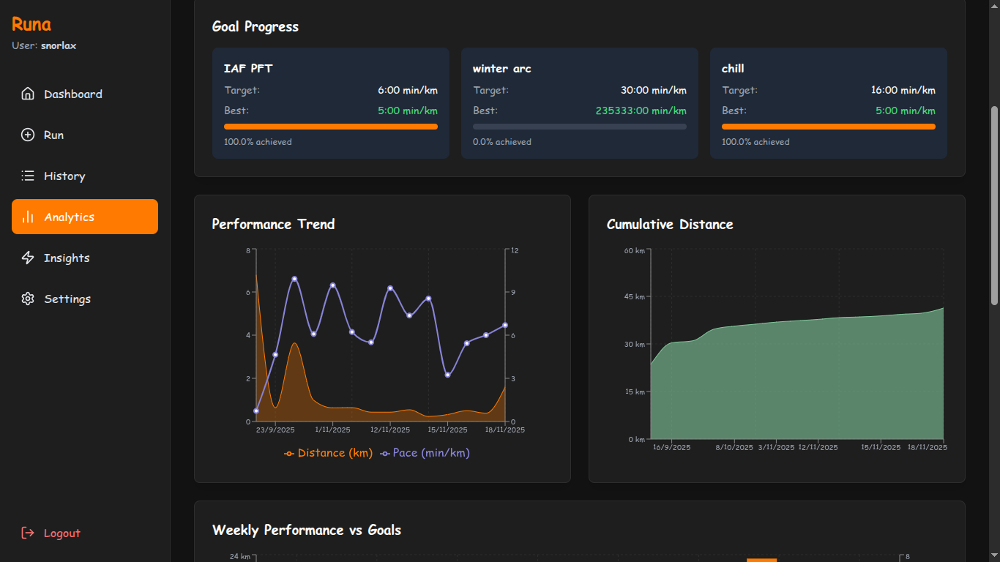

<div align="center">
<<<<<<< HEAD

=======

>>>>>>> main
</div>
> more screenshots at assets/ folder

# AI Fitness Tracker

A modern, AI-powered fitness tracker designed to monitor your running progress, set personalized goals, and provide intelligent insights into your performance. Built with React and TypeScript for a seamless user experience.

## Features

### 🏃‍♂️ Core Functionality
- **Run Tracking**: Log runs with distance, time, pace, and personal notes
- **Goal Setting**: Set weekly distance targets and running frequency goals
- **Performance Analytics**: View detailed charts and trends of your progress
- **AI Insights**: Get intelligent recommendations for improvement
- **Progress Dashboard**: Overview of recent activities and achievements

### 📊 Analytics & Visualization
- **Pace Trends**: Track your running pace over time (MM:SS format)
- **Speed Analysis**: Monitor average and maximum speed improvements
- **Distance Tracking**: Weekly and monthly distance summaries
- **Activity Heatmap**: Visual representation of running frequency
- **Performance Charts**: Interactive graphs with detailed tooltips

### 🔒 Data Management
- **Local Storage**: All data stored securely in your browser
- **Backup & Restore**: Export/import data as JSON files
- **Data Privacy**: No external servers, complete privacy
- **Multi-user Support**: Username-based data separation

### 🎨 User Experience
- **Responsive Design**: Works on desktop and mobile devices
- **Dark Theme**: Easy on the eyes with modern UI
- **Password Protection**: Secure access with environment-based authentication
- **Toast Notifications**: User-friendly feedback system
- **Smooth Navigation**: Intuitive routing and lazy loading

## Technology Stack

- **Frontend**: React 19.2.0 with TypeScript
- **Routing**: React Router DOM 7.9.6
- **Charts**: Recharts 3.4.1 for data visualization
- **Icons**: Lucide React for modern iconography
- **Styling**: Tailwind CSS via CDN
- **Build Tool**: Vite 6.2.0
- **AI Integration**: Google Gemini API for insights

## Getting Started

### Prerequisites
- Node.js (v16 or higher)
- npm or yarn package manager

### Installation

1. **Clone the repository**
   ```bash
   git clone <repository-url>
   cd aifit
   ```

2. **Install dependencies**
   ```bash
   npm install
   ```

3. **Set up environment variables**
   Create a `.env.local` file in the root directory:
   ```env
   GEMINI_API_KEY=your_gemini_api_key_here
   GETIN_PASSWORD=your_login_password_here
   ```

4. **Start the development server**
   ```bash
   npm run dev
   ```

5. **Open your browser**
   Navigate to `http://localhost:3000`

### Usage

1. **Login**: Enter any username and the configured password
2. **Setup Profile**: Add your personal information in Settings
3. **Set Goals**: Define your weekly running targets
4. **Track Runs**: Use "Add Run" to log your activities
5. **View Analytics**: Monitor your progress in the Analytics section
6. **Get Insights**: Check AI-powered recommendations
7. **Backup Data**: Export your data regularly from Settings

## Project Structure

```
aifit/
├── components/          # Reusable UI components
│   ├── Card.tsx        # Container component
│   ├── Layout.tsx      # Main layout with navigation
│   ├── Modal.tsx       # Modal dialogs
│   ├── Toast.tsx       # Notification system
│   └── ...
├── pages/              # Main application pages
│   ├── Dashboard.tsx   # Home overview
│   ├── AddRun.tsx      # Run logging form
│   ├── Analytics.tsx   # Charts and statistics
│   ├── Settings.tsx    # User preferences
│   └── ...
├── context/            # React context for state management
├── services/           # Data services and API calls
├── types.ts           # TypeScript type definitions
└── ...
```

## Data Privacy & Security

- **Local Storage Only**: All personal data stays on your device
- **No External Tracking**: No analytics or tracking services
- **Password Protection**: Configurable access control
- **Backup Control**: You control your data exports
- **Open Source**: Transparent codebase for security review

## Contributing

This is a personal project, but suggestions and feedback are welcome! Contact the developer through the channels listed below.

## Developer

**Ravi Ranjan Sharma**
Tech enthusiast who loves building innovative projects and crafting problem-solving software with the latest technologies.

### Connect
- **GitHub**: [codebysnorlax](https://github.com/codebysnorlax)
- **Email**: rr2436310@gmail.com
- **Portfolio**: [snorlax-ai.netlify.app](https://snorlax-ai.netlify.app)
- **Instagram**: [@nr_snorlax](https://instagram.com/nr_snorlax)
- **Twitter**: [@codebysnorlax](https://twitter.com/codebysnorlax)
- **LinkedIn**: [ravi-ranjan-9b338b333](https://linkedin.com/in/ravi-ranjan-9b338b333)

## License

This project is for personal use. All rights reserved.

## Acknowledgments

- Built with modern web technologies
- Inspired by the need for privacy-focused fitness tracking
- Designed for runners who value data ownership
- Created with passion for clean, functional software

---

*Keep running, keep improving!*
